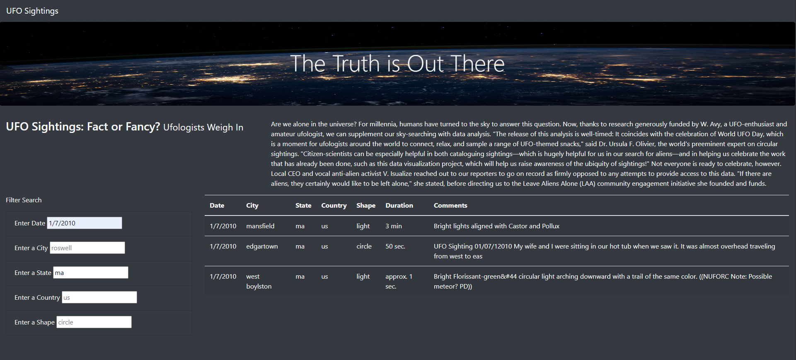

# UFOs

## Purpose Of Project
To update Dana's webpage to allow users to filter for multiple criteria and provide a more concise UFO sightings data.

## Results
With the update to the index.html file, we are now able to filter other criteria including Date, City, State, Country, and Shape. This allows the users to adjust their search parameters. For example, the user wants to search for sightings on a given date 1/7/2010 in the state of Massachusetts:

The filter has also been modified to update the table as the user enter the filters. This image shows us the narrowed down sightings on for UFO in the state of Massachusetts on 1/7/2010. As you can see, the table updates as the users enter the desired parameter.

## Summary
There is one major drawback to our filter. It is our data. The users do not have access to our data file. Thus, they do not know what earch criteria there are unless they scroll through the table. For example, the users will not know the range of dates we have on our data file. Making it difficult for users to search

However, it is not impossible to fix. One suggestion is to make our filter text boxes into drop-down buttons that includes the options to each search criteria.

To further improve our website, we can include extra column that links our sources for each row (if available) so they can "validate" or contact the sources of our data.

